# PEC Code Review Resolution Design Spec

## 1. Overview & Context

This design resolves the architectural and behavioral issues identified in the code review where the PEC Chrome MV3 extension appears active (badge "PAC", status "Active") but fails to proxy traffic in practice.

The core diagnosis revealed three compounding defaults:
1. Packaged evaluation builds pointed to `http://localhost:3000` or raw `extension/` was loaded with unrendered placeholders (`__PEC_SERVER_BASE__`), disabling sync.
2. Default routing profile (`profile_default_split`) is "Direct by Default" (`defaultPolicy: "direct"`), directing all non-matching traffic to `DIRECT` without visible notification in the UI.
3. Default proxy node initialized as dead placeholder `10.0.0.1:10809` with a fail-open `; DIRECT` fallback in PAC directives, silently bypassing proxying on connection failures.
4. Packaging generator in `src/packager.ts` overwrote `extension/popup.html` and `extension/popup.js` with outdated templates lacking the diagnostics log terminal introduced in commit `ea7eb28`.
5. Stale saved tokens in `extension_build_config.json` took precedence over `EXT_SHARED_TOKEN`, causing 403 authorization failures on `/api/sync`.
6. `/api/extension/download-zip` was publicly accessible without rate limiting or authentication.

---

## 2. Phased Architecture & Scope

```mermaid
flowchart TD
    subgraph Phase1["Phase 1: Build & Package Integrity (P0)"]
      T1["T1: pack-extension.ts mandatory URL & release.yml"]
      T2["T2: Placeholder fail-fast guard & README"]
      T3["T3: Sync popup templates in packager.ts"]
      T4["T4: Centralize popup templates in extensionTemplates.ts"]
      T9["T9: Dynamic EXT_SHARED_TOKEN precedence"]
    end

    subgraph Phase2["Phase 2: Routing Visibility & Diagnostics (P0)"]
      T5["T5: Expose profileDefaultPolicy in /api/sync & popup"]
      T13["T13: Transparent routing mode indicator"]
      T10["T10: Honest HTTP error logging in background.js"]
    end

    subgraph Phase3["Phase 3: Proxy Health & Fallback Safety (P0)"]
      T6["T6: TCP probeActiveProxy + unreachable ERR badge"]
      T7["T7: Opt-in failClosed routing profile flag"]
    end

    subgraph Phase4["Phase 4: Security & Endpoint Hardening (P1)"]
      T8["T8: Authenticated ZIP download + CSRF + Rate Limiting"]
    end

    subgraph Phase5["Phase 5: DX, Hygiene & Polish (P2)"]
      T11["T11: package.json build:server and build:extension"]
      T12["T12: Output separation (dist/unpacked vs extension)"]
      T14["T14: Fix extension/README.md pack instructions"]
      T15["T15: Port 10808 cleanup & template safety"]
      T16["T16: Extension pure logic unit tests"]
    end

    Phase1 --> Phase2 --> Phase3 --> Phase4 --> Phase5
```



---

## 3. Detailed Component Specifications

### 3.1 Phase 1: Build & Package Integrity

#### T1: CLI and Release Build URL Requirement
- **File:** `scripts/pack-extension.ts`
  - Check `process.env.PEC_SERVER_URL || process.env.PUBLIC_BASE_URL`.
  - If empty or whitespace, log actionable error:
    `"[pack] FATAL: целевой сервер не задан — в расширение будет зашит нерабочий адрес. Укажите его явно: PEC_SERVER_URL=https://pec.example.corp npm run pack:extension"`
    and `process.exit(1)`.
- **File:** `.github/workflows/release.yml`
  - In `Verify` step: invoke `PEC_SERVER_URL=http://localhost:3000 npm run pack:extension`.
  - In `Package release artifacts` step: rename copied zip to `release-assets/pec-extension-LOCALHOST-EVAL-v${VERSION}.zip`.
- **File:** `README.md`
  - Add explicit note on packaging with `PEC_SERVER_URL`.

#### T2: Template Placeholder Fail-Fast Guard
- **Files:** `extension/background.js` and `src/extensionTemplates.ts` (`BACKGROUND_TEMPLATE`)
  - Directly after `DEFAULT_SERVER_BASE` declaration:
    ```javascript
    if (DEFAULT_SERVER_BASE.indexOf("__PEC_") !== -1) {
      console.error(
        "[corp-proxy] FATAL: server URL placeholder was not substituted. " +
        "You probably loaded the raw extension/ template directory instead of the " +
        "built dist/unpacked/ output. Proxy sync is DISABLED."
      );
    }
    ```
- **File:** `README.md`
  - Under local testing, highlight loading `dist/unpacked/` in `chrome://extensions`, not `extension/`.

#### T3 & T4: Popup Templates Centralization & Log Terminal
- **Files:** `src/extensionTemplates.ts` and `src/packager.ts`
  - Define `POPUP_HTML_TEMPLATE(cfg, t)` and `POPUP_JS_TEMPLATE(cfg, t)` in `src/extensionTemplates.ts`.
  - Port event log HTML structure (`#logContainer`, `#logCountTag`, `#btnCopyLogs`, `#btnClearLogs`) into Tab 3 (Diagnostics).
  - Port `switchPopupTab` log loading hook and `Diagnostics log viewer` routines (`renderLogs`, `loadLogs`, `formatTime`, button listeners) into `POPUP_JS_TEMPLATE`.
  - Replace inline `popupHtml` and `popupJs` generation in `src/packager.ts` by delegating to `POPUP_HTML_TEMPLATE` and `POPUP_JS_TEMPLATE`.

#### T9: Dynamic EXT_SHARED_TOKEN Precedence
- **File:** `src/packager.ts`
  - In `packageExtension(baseUrl, options)`:
    Override `buildConfigToPack.defaultToken = process.env.EXT_SHARED_TOKEN || currentBuildConfig.defaultToken`.
  - If `process.env.EXT_SHARED_TOKEN` exists and differs from `currentBuildConfig.defaultToken`, log:
    `"[packager] Saved build-config defaultToken differs from EXT_SHARED_TOKEN - overriding with env value."`

---

### 3.2 Phase 2: Routing Visibility & Diagnostics

#### T5 & T13: Profile Policy Visibility & Dashboard Switch
- **File:** `src/routes/credsRoutes.ts`
  - Include `profileDefaultPolicy: assignedProfile.defaultPolicy` in `/api/sync` JSON response.
- **Files:** `extension/background.js` and `src/extensionTemplates.ts`
  - Save `profileDefaultPolicy` into `currentProxyState`.
- **Files:** `extension/popup.js` and `src/extensionTemplates.ts` (`POPUP_JS_TEMPLATE`)
  - Update `applyPopupState`:
    - Mode tag shows `response.protocol.toUpperCase() + (response.profileDefaultPolicy === "direct" ? " (селективный)" : " (полный)")`.
    - If `routingMode === "pac"`, display policy in rules tab and header.
- **Files:** `src/dashboardView.ts` and `public/dashboard.js`
  - Add a quick toggle on the Proxy Settings tab: "Политика маршрутизации по умолчанию" (Селективный прокси [Direct by Default] vs Полный туннель [Proxy by Default]).
  - Saving this updates the active default profile's `defaultPolicy` via `POST /api/routing/profiles`.

#### T10: Honest HTTP Error Logging
- **Files:** `extension/background.js` and `src/extensionTemplates.ts`
  - In `syncProxyConfig()`, if `!res.ok`:
    `logEvent("warn", "Sync endpoint returned HTTP " + res.status + " - falling back to /creds");`

---

### 3.3 Phase 3: Proxy Health & Fallback Safety

#### T6: TCP Health Probe & ERR Badge
- **File:** `src/proxies.ts`
  - Implement `probeActiveProxy(timeoutMs = 1500): Promise<boolean>` with `net.Socket` and 30-second timestamp caching.
  - In `initDefaultProxyIfNeeded()`, set `isActive: Boolean(process.env.PROXY_HOST)` and `status: process.env.PROXY_HOST ? "OK" : "IDLE"`, preventing automatic activation of the dead `10.0.0.1` placeholder.
- **File:** `src/routes/credsRoutes.ts`
  - In `/api/sync`, call `await probeActiveProxy()` and return `proxyReachable: boolean`.
- **Files:** `extension/background.js` and `src/extensionTemplates.ts`
  - If `payload.proxyReachable === false`, log error event:
    `"Прокси-сервер " + payload.config.host + ":" + payload.config.port + " недоступен — трафик уходит в обход (fallback DIRECT)"`
    and call `updateBadge("ERR", "#ef4444")`.

#### T7: Opt-in Fail-Closed Profile Flag
- **Files:** `src/types.ts`, `src/routing.ts`, `src/dashboardView.ts`, `public/dashboard.js`
  - Add optional `failClosed?: boolean` to `RoutingProfile`.
  - In `generatePacScript()`:
    If `profile.failClosed === true`, omit `; DIRECT` from proxy directive:
    `const proxyDirective = profile.failClosed ? \`${base} ${direct}\` : \`${base} ${direct}; DIRECT\`;`
  - Add checkbox in dashboard profile editor: "Блокировать трафик при недоступности прокси (Fail-closed)".

---

### 3.4 Phase 4: Security & Endpoint Hardening

#### T8: Authenticated ZIP Download & CSRF
- **File:** `server.ts`
  - Remove `"/extension/download-zip"` from `PUBLIC_API_PATHS`.
- **File:** `src/routes/builderRoutes.ts`
  - Add `createRateLimiter({ windowMs: 60_000, maxRequests: 10, message: "Download rate limit exceeded." })` to `GET /api/extension/download-zip`.
- **File:** `public/dashboard.js`
  - In `downloadExtensionPackage(type)`:
    Download ZIP via authenticated `fetch('/api/extension/download-zip', { headers: { 'X-Requested-With': 'pec-dashboard' } })`, convert to Blob, and trigger browser download.
- **File:** `SECURITY.md`
  - Document that `/updates/extension.crx` remains public for Google Chrome GPO update checks and contains the shared fleet token, requiring server placement behind VPN or internal corporate perimeter.

---

### 3.5 Phase 5: DX, Hygiene & Polish

#### T11: npm Scripts
- **File:** `package.json`
  - Add `"build:server": "esbuild server.ts --bundle --platform=node --format=cjs --packages=external --outfile=dist/server.cjs"`
  - Add `"build:extension": "tsx scripts/pack-extension.ts"`
- **File:** `README.md`
  - Document build commands clearly in a table.

#### T12: Output Directory Separation
- **File:** `src/packager.ts`
  - Direct `generateExtensionFiles()` output to `dist/unpacked/`. Only copy into `extension/` if files do not exist or when `PEC_KEEP_EXTENSION_DIR=1` is set.

#### T14, T15, T16: Minor Fixes & Pure Logic Tests
- Fix `extension/README.md` to reference `npm run pack:extension` instead of nonexistent `pack.py`.
- Clean up port `10808` fallback in `src/proxies.ts:235`.
- Add unit tests for PAC domain sanitization and state machine functions in Node environment.

---

## 4. Verification & Testing Strategy

Each phase requires:
1. Automated unit/integration tests running with `npx tsx --test`.
2. Clean `npm test` across the full test suite with 0 regressions.
3. Clean `npm run build` compilation.
4. Independent git commit per task with descriptive message.
